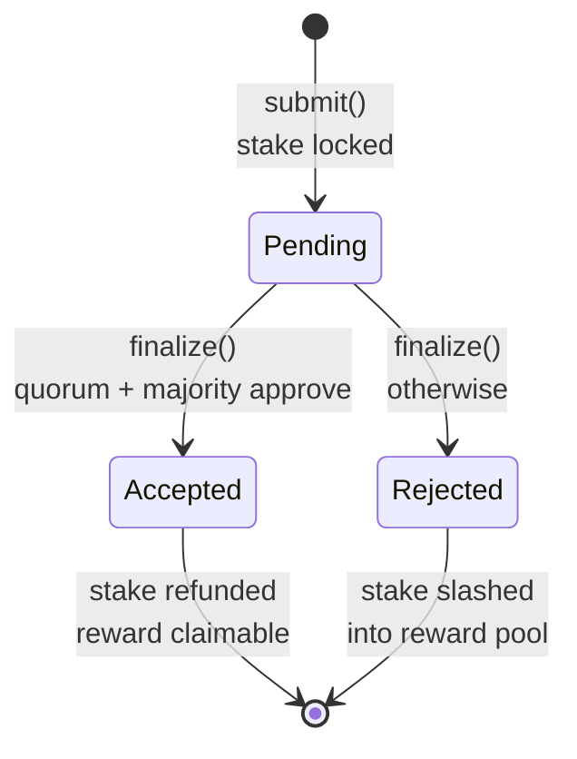
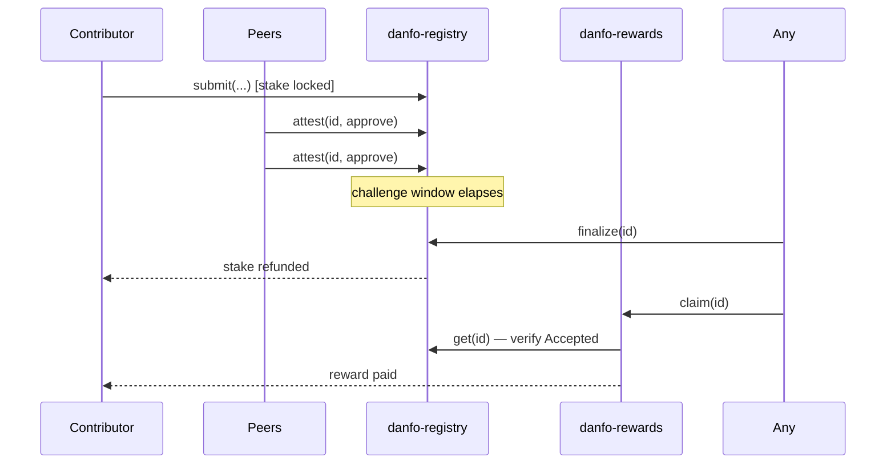
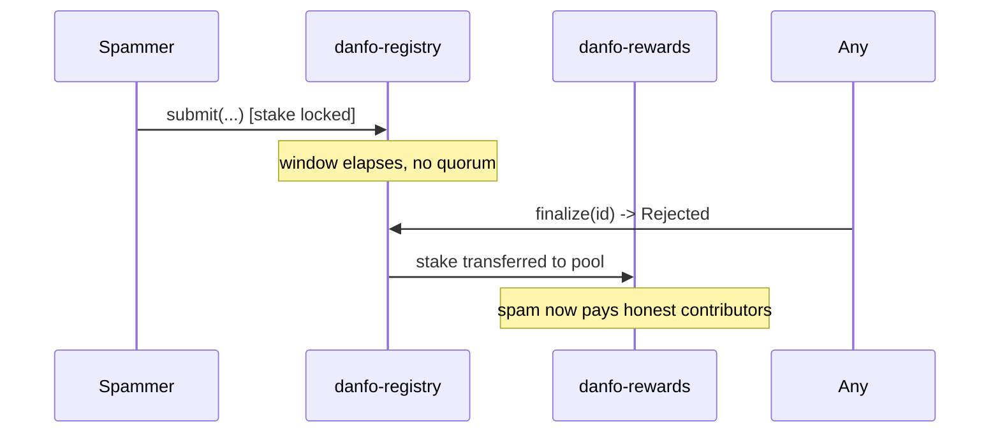

# Correction lifecycle

A correction moves through exactly three states, and the transitions are
one-way.



## 1. Submit

```
submit(contributor, route_id, kind, payload_hash, summary) -> u32
```

The contributor authorises the call and `stake_amount` moves from their
account into the registry contract. They get back a 0-based correction id.

What is actually stored on-chain is small and deliberate:

* `payload_hash` — the sha256 of the off-chain JSON this correction anchors.
  The full payload lives off-chain; the chain stores only a commitment to it.
* `summary` — one human-readable sentence, capped at 280 bytes.
* `route_id` — a slug like `cms-oshodi`, capped at 64 bytes.

Both string caps are enforced **before** the stake transfer, so a malformed
submission costs nothing but the transaction fee.

`kind` is one of `Fare`, `Route`, or `Closure`.

## 2. Attest

```
attest(voter, id, approve)
```

During the challenge window, peers approve or reject. Three guards apply:

| Guard | Error |
| --- | --- |
| The correction must still be `Pending` | `NotPending` (`#5`) |
| A contributor cannot vote on their own correction | `SelfVote` (`#6`) |
| One vote per address per correction | `AlreadyVoted` (`#4`) |

Votes are recorded as a `Voted(id, address)` key, which is why
`has_voted(id, voter)` can answer cheaply without scanning.

Note what is **not** here: there is no weighting, no stake behind a vote, and
no penalty for voting wrongly. That is a known limitation — see
[Threat model](threat-model.md#attestation-is-one-address-one-vote).

## 3. Finalize

```
finalize(id) -> Status
```

Callable by **anyone**, with no auth, once `finalize_after` has passed. This is
safe because funds only ever move to addresses recorded at submission time:
the stake goes back to `correction.contributor` or forward to
`config.slash_recipient`. A stranger cranking `finalize` cannot redirect a
single stroop.

The acceptance rule is:

```rust
approvals + rejections >= min_votes  &&  approvals > rejections
```

Two consequences worth internalising:

* **A tie rejects.** `approvals > rejections` is strict.
* **Silence rejects.** A correction nobody looks at fails the quorum test and
  is slashed. Attention is the scarce resource, so the default is "no".

Accepted → stake refunded, contributor's accepted-count incremented.
Rejected → stake transferred to `slash_recipient`, which after deployment is
the rewards pool.

## 4. Claim

```
rewards.claim(id)
```

Also callable by anyone, also with no auth, and idempotent per correction id.
The rewards contract does a cross-contract read of `registry.get(id)` and
refuses unless the status is `Accepted` — it never takes the caller's word for
anything.

The payout goes to `correction.contributor` as read from the registry, so
cranking a claim on someone else's behalf is a favour, not an attack.

Ordering inside `claim` matters: the `Claimed(id)` flag is written **before**
the token transfer, so a re-entrant token could not double-spend the pool.

## The full path



And the rejected path, which is what funds the whole thing:


